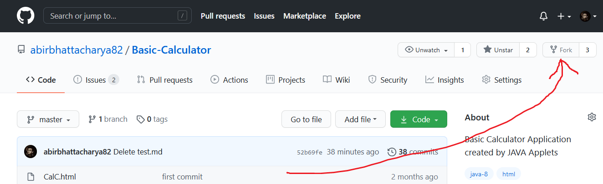
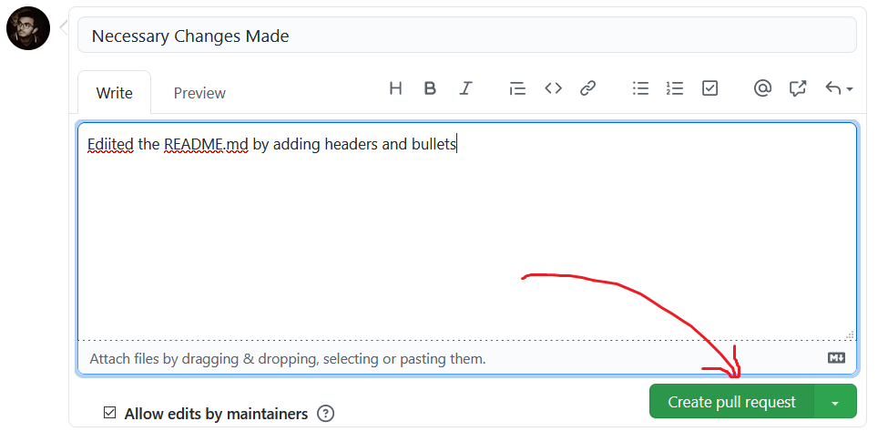

# How to Contribute
## Conntributing to my repository is very Easy and Not at all difficullt.  Just follow few steps and you are good to go.
* ### Step 1: 
Fork the Repository. The Fork option is located on the top right side of you screen beside Star/ Unstar option. Forking this repository will make an exaclty identical repo of this one only under your username. This ensures that if you are making any changes which may not be acceptable (most of the time its not) then it wont affect the main repository that is mine over here.

* ### Step 2: 
Go to Add File and select Upload File. This will allow you to add files in your machine to the cloned Repository.

* ### Step 3: 
Now you need to make the commit to push this file in the Repository finally. This is done by providing a brief description of what changes you made and then press commit.

* ### Step 4: 
Now the file is pushed in the clonned Repo. All you need to do is create a Pull Request (PR). Click on Pull Request and the click on New Pull Request.

* ### Step 5: 
Click on Create Pull Request

* ### Step 6: 
Provide the decriptions of the PR and click on Create Pull Request. and Viola you did it.

